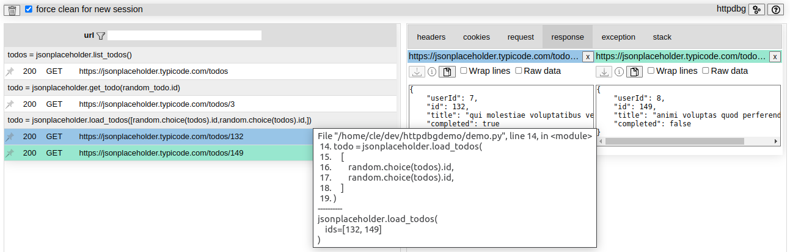

[](https://github.com/cle-b/httpdbg/actions?query=workflow%3ABuild) [](https://badge.fury.io/py/httpdbg) [](https://coveralls.io/github/cle-b/httpdbg?branch=main)
# httpdbg

A very simple tool to debug HTTP(S) client requests.


## installation 

```
pip install httpdbg
```

## usage

### interactive console

Open an interactive console using the following command: `pyhttpdbg`

```
(venv) dev@host:~/dir$ pyhttpdbg 
.... - - .--. -.. -... --. .... - - .--. -.. -... --. .... - - .--. -.. -... --.
  httpdbg - HTTP(S) requests available at http://localhost:4909/
.... - - .--. -.. -... --. .... - - .--. -.. -... --. .... - - .--. -.. -... --.
Python 3.10.6 (main, Aug 10 2022, 11:40:04) [GCC 11.3.0] on linux
Type "help", "copyright", "credits" or "license" for more information.
(InteractiveConsole)
>>> 
```

Perform HTTP requests.

You can inspect the HTTP requests directly in your web browser at http://localhost:4909.

### script

You can trace all the HTTP requests performed by a script

```sh
pyhttpdbg --script filename.py [arg1 --arg2 ...]
```

### pytest

You can trace all the HTTP requests performed during your tests

```sh
pyhttpdbg -m pytest [arg1 --arg2 ...]
```

*note: the HTTP(S) requests are not recorded if the tests are executed in parallel using plugin like `xdist`*.

### module

You can trace all the HTTP requests performed by a library module run as a script using the `-m` command line argument.

For example, you can view which HTTP requests are performed by `pip` when you install a package.

```sh
pyhttpdbg -m pip install httpdbg --upgrade
```


## Supported libraries

| library    | status      | 
|------------|-------------|
| requests   | supported   |
| urllib3    | supported   |
| httpx      | supported   |
| aiohttp    | supported   |

## configuration

No configuration is necessary to start but some few settings are available for particular use.

### command line

```
usage: pyhttpdbg [-h] [--port PORT] [--version] [--keep-up | --force-quit]
                 [--console | --module MODULE | --script SCRIPT]

httdbg - a very simple tool to debug HTTP(S) client requests

options:
  -h, --help            show this help message and exit
  --version, -v         print the httpdbg version

  --port PORT, -p PORT  the web interface port
  
  --keep-up, -k         keep the server up even if the requests have been read
  --force-quit, -q      stop the server even if the requests have not been read

  --console             run a python console (default)
  --module MODULE, -m MODULE
                        run library module as a script (the next args are passed to pytest as is)
  --script SCRIPT       run a script (the next args are passed to the script as is)
```

### web interace 

Clic on the **&#9881;** button on the top right of the page.

Some options are available:
  * Hide the netloc in the url
  * Hide the initiator rows

To keep your configuration, bookmark the page with the full search query.

Fox example, if you want to hide the initiator rows by default, the url will be:
```
http://localhost:4909/?hi=on
```

## web interface

All the requests recorded are available on the web interface. 

The requests:
 * are still available in the web page even if the python process stopped (except if you force quit before the requests have been loaded by the web page).
 * are automatically cleaned if a new execution is detected.
